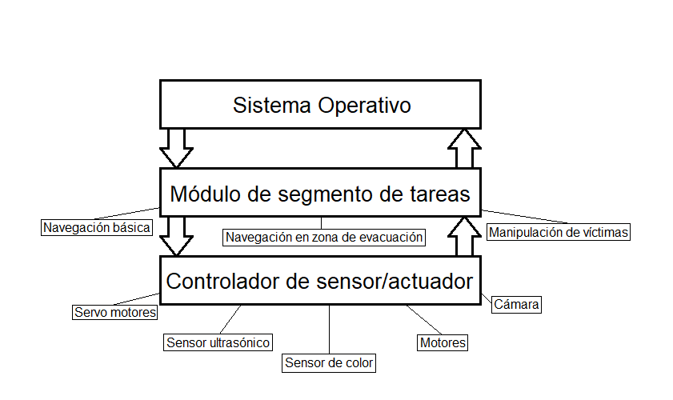

# RoboCupJunior 2024 (Crusaders Team)

## Arquitectura de software

El software de este proyecto está basado en una arquitectura de capas. Cuenta con tres niveles/capas: **controladores**, **módulo de segmento de tareas** y **sistema operativo**.

> [!NOTE]
> La capa *Sistema Operativo* no hace referencia a un OS (como Windows o macOS), sino al software en su conjunto que actúa como un sistema unificado.

### Capa baja: Controlador de sensor/actuador

Se supone que cada controlador es una clase que encapsula todos los métodos necesarios para interactuar con cada sensor/actuador de forma sencilla y personalizable.

Los sensores/actuadores básicos utilizados son:

- Sensores de color TCS3200 (x2).
- Sensor ultrasónico.
- Controlador de motores L298N.
- Servo motores.
- Cámara.

### Capa media: Módulo de segmento de tareas

El robot tiene una meta dividida en tareas. Cuando juntamos un grupo específico de tareas (segmento de tareas), podemos hacer referencia a diferentes áreas de la pista o recorridos. Dicho de otra forma, podemos dividir el recorrido completo de la pista (meta) en áreas y estas, a su vez, en tareas.

Entonces, en el software, podemos tener un módulo para juntar las herramientas de la capa baja y cumplir con un grupo de tareas.

Un ejemplo claro sería utilizar los controladores del sensor de color y motores para seguir la línea. Hacer esto es cumplir con una tarea de *Navegación básica*.

Los segmentos y sus tareas son los siguientes:

- Navegación básica.
  - Seguir línea.
    - Sig-sag.
    - Líneas discontinuas.
  - Indicadores verdes.
  - Esquivar obstáculos.
- Navegación en zona de evacuación.
- Manipulación de víctimas en zona de evacuación.

> [!NOTE]
> Los segmentos pueden estar incompletos o erróneos. Todavía están en planificación.

### Capa alta: Sistema Operativo

Se supone que aquí los módulos de la capa media se mezclan lógicamente.

## Requerimientos
* Los requerimientos de [ImageAI](https://imageai.readthedocs.io/en/latest/).
* Python (>=3.11.4)

## Tabla de conexiones

### TCS3200 N.° 1

| TCS3200 | RPi 4 (BOARD) |
|:-------:|:-------------:|
|   VCC   |    2 (5V)     |
|   GND   |    6 (GND)    |
|    OE   |    6 (GND)    |
|    S0   |    6 (GND)    |
|    S1   |     2 (5V)    |
|    S2   |  11 (GPIO 17) |
|    S3   |  13 (GPIO 27) |
|   OUT   |  15 (GPIO 22) |

### Controlador L298N
| L298N | RPi 4 (BOARD) |
|:-----:|:-------------:|
| ENA | 33 (GPIO 13, PWM1) |
| IN1 | 8 (GPIO 14) |
| IN2 | 10 (GPIO 15) |
| ENB | 32 (GPIO 12, PWM0) |
| IN3 | 12 (GPIO 18) |
| IN4 | 16 (GPIO 23) |